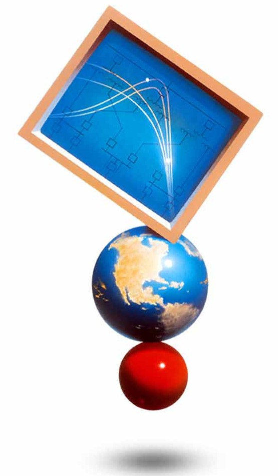

## INTRODUCTION 🙋
Hello,  I am **Muhammad Bilal** anambitious and highly motivated **Electrical Engineer** with a strong passion for problem-solving and innovation. My ability to analyze and develop systems allows me to work effectively on engineering challenges. I am always interested in learning new technologies and improving my technical skills.
## CONNECT WITH ME 🤝

   

## SKILLS 🛠️

 

  <!-- Skill card -->
  <figure style="margin:0; text-align:center;">
    
    <!-- Caption removed -->
  </figure>   
  <figure style="margin:0; text-align:center;">
    
    <!-- Caption removed -->
  </figure>
  <figure style="margin:0; text-align:center;">
    
    <!-- Caption removed -->
  </figure> 
  <figure style="margin:0; text-align:center;">
    
    <!-- Caption removed -->
  </figure>   
  <figure style="margin:0; text-align:center;">
    
    <!-- Caption removed -->
  </figure>
  <figure style="margin:0; text-align:center;">
    
    <!-- Caption removed -->
  </figure>
  <figure style="margin:0; text-align:center;">
    
    <!-- Caption removed -->
  </figure>   

## AWARDS & CERTIFICATIONS 🏆
 <!-- Achievements Section -->

  <!-- AWARDS -->
  

    <h3 style="margin-bottom:0.8rem; font-size:1.3rem;">🏆 AWARDSs</h3>
    <ul style="line-height:1.8; padding-left:1.2rem; list-style: '✨ ';">
      <li><strong>Prime Minister’s Laptop Award</strong> (Jun 2024) – Higher Education Commission (HEC), Pakistan. Awarded a laptop under the Prime Minister’s Youth Laptop Scheme for outstanding academic performance.</li>
      <li><strong>BEEF Scholarship Award</strong> (Aug 2024) – Baluchistan Education Endowment Fund (BEEF). Recipient of the scholarship for academic excellence.</li>
      <li><strong>HEC Scholarship Award</strong> (Jun 2024) – Higher Education Commission (HEC), Pakistan. Merit-based award for students of Baluchistan and Erstwhile FATA.</li>
    </ul>
  

  <!-- CERTIFICATIONS -->
  

    <h3 style="margin-bottom:0.8rem; font-size:1.3rem;">📜 CERTIFICATIONS</h3>
    <ul style="line-height:1.8; padding-left:1.2rem; list-style: '✅ ';">
      <li><strong>Introduction to Programming with MATLAB</strong> – Vanderbilt University (Mar 2025)</li>
      <li><strong>Programming for Everybody (Getting Started with Python)</strong> – University of Michigan (Feb 2025)</li>
    </ul>
  

## Projects 
<!-- Project Cards (paste inside your Projects section) -->

  <!-- Project 1 -->
  <article style="background:#fff; border:1px solid #e5e7eb; border-radius:14px; padding:16px; box-shadow:0 4px 12px rgba(0,0,0,.05);">
    <header style="margin-bottom:8px;">
      <h3 style="margin:0 0 6px; font-size:1.05rem; line-height:1.35;">
        📡 Performance Evaluation of Min-Max and Trilateration Algorithms for Long-Range RF-Based Indoor Localization
      </h3>
      
Sep 2024 – Jul 2025

    </header>

    <!-- Badges / tools -->
    

      MATLAB
      Embedded C
      Long-Range (LoRa)
    

    <ul style="margin:0; padding-left:18px; line-height:1.6;">
      <li>Empirically evaluated Min-Max and Trilateration for LoRa-based indoor localization using accuracy, execution time, and standard deviation.</li>
      <li>Analyzed impact of anchor node diversity on localization accuracy by varying reference nodes.</li>
      <li>Used real-time RSSI datasets from dynamic indoor environments to optimize LoRa systems.</li>
    </ul>

    <!-- Optional buttons (uncomment and add links if available)
    

      <a href="YOUR_REPO_LINK" style="text-decoration:none; font-size:13px; padding:6px 10px; border-radius:8px; border:1px solid #e5e7eb;">🔗 Repository</a>
      <a href="YOUR_DEMO_LINK" style="text-decoration:none; font-size:13px; padding:6px 10px; border-radius:8px; border:1px solid #e5e7eb;">🎥 Demo</a>
      <a href="YOUR_PAPER_LINK" style="text-decoration:none; font-size:13px; padding:6px 10px; border-radius:8px; border:1px solid #e5e7eb;">📄 Paper</a>
    

    -->
  </article>

  <!-- Project 2 -->
  <article style="background:#fff; border:1px solid #e5e7eb; border-radius:14px; padding:16px; box-shadow:0 4px 12px rgba(0,0,0,.05);">
    <header style="margin-bottom:8px;">
      <h3 style="margin:0 0 6px; font-size:1.05rem; line-height:1.35;">
        ☁️ Internet of Things (IoT) Based Weather Monitoring System
      </h3>
      
Apr 2023 – Jul 2023

    </header>

    <!-- Badges / tools -->
    

      Embedded C
      ESP32
      Sensors
    

    <ul style="margin:0; padding-left:18px; line-height:1.6;">
      <li>Built a cost-effective, scalable ESP32-based system for continuous weather parameter tracking.</li>
      <li>Enabled real-time monitoring for accurate environmental analysis.</li>
      <li>Delivered a reliable solution for smart monitoring and automation use-cases.</li>
    </ul>

    <!-- Optional buttons (uncomment and add links if available)
    

      <a href="YOUR_REPO_LINK" style="text-decoration:none; font-size:13px; padding:6px 10px; border-radius:8px; border:1px solid #e5e7eb;">🔗 Repository</a>
      <a href="YOUR_DEMO_LINK" style="text-decoration:none; font-size:13px; padding:6px 10px; border-radius:8px; border:1px solid #e5e7eb;">📊 Live Dashboard</a>
    

    -->
  </article>

