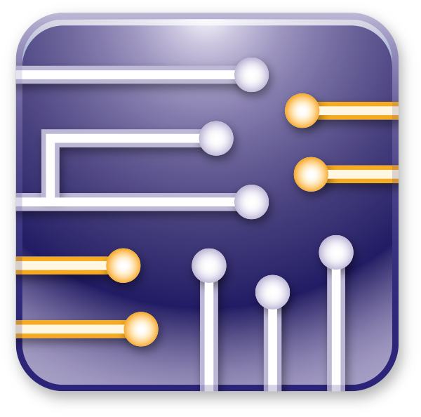

## INTRODUCTION 🙋
Hello,  I am **Muhammad Bilal** anambitious and highly motivated **Electrical Engineer** with a strong passion for problem-solving and innovation. My ability to analyze and develop systems allows me to work effectively on engineering challenges. I am always interested in learning new technologies and improving my technical skills.
## CONNECT WITH ME 🤝

   

## SKILLS 🛠️

 

  <!-- Skill card -->
  <figure style="margin:0; text-align:center;">
    
    <!-- Caption removed -->
  </figure>   
  <figure style="margin:0; text-align:center;">
    
    <!-- Caption removed -->
  </figure>
  <figure style="margin:0; text-align:center;">
    
    <!-- Caption removed -->
  </figure> 
  <figure style="margin:0; text-align:center;">
    
    <!-- Caption removed -->
  </figure>   
  <figure style="margin:0; text-align:center;">
    
    <!-- Caption removed -->
  </figure>
  <figure style="margin:0; text-align:center;">
    
    <!-- Caption removed -->
  </figure>
  <figure style="margin:0; text-align:center;">
    
    <!-- Caption removed -->
  </figure>   

## AWARDS & CERTIFICATIONS 🏆
 <!-- Achievements Section -->

  <!-- AWARDS -->
  

    <h3 style="margin-bottom:0.8rem; font-size:1.3rem;">🏆 AWARDS</h3>
    <ul style="line-height:1.8; padding-left:1.2rem; list-style: '✨ ';">
      <li><strong>Prime Minister’s Laptop Award</strong> (Jun 2024) – Higher Education Commission (HEC), Pakistan. Awarded a laptop under the Prime Minister’s Youth Laptop Scheme for outstanding academic performance.</li>
      <li><strong>BEEF Scholarship Award</strong> (Aug 2024) – Baluchistan Education Endowment Fund (BEEF). Recipient of the scholarship for academic excellence.</li>
      <li><strong>HEC Scholarship Award</strong> (Jun 2024) – Higher Education Commission (HEC), Pakistan. Merit-based award for students of Baluchistan and Erstwhile FATA.</li>
    </ul>
  

  <!-- CERTIFICATIONS -->
  

    <h3 style="margin-bottom:0.8rem; font-size:1.3rem;">📜 CERTIFICATIONS</h3>
    <ul style="line-height:1.8; padding-left:1.2rem; list-style: '✅ ';">
      <li><strong>Introduction to Programming with MATLAB</strong> – Vanderbilt University (Mar 2025)</li>
      <li><strong>Programming for Everybody (Getting Started with Python)</strong> – University of Michigan (Feb 2025)</li>
    </ul>
  

## PROJECTS 📂 
<!-- Project 1 -->
<h3>📡 Performance Evaluation of Min-Max and Trilateration Algorithms for Long-Range RF-Based Indoor Localization</h3>

<em>Sep 2024 – Jul 2025</em>

<strong>Tools:</strong> <code>MATLAB</code> • <code>Embedded C</code> • <code>LoRa</code>

<ul>
  <li>Empirically evaluated Min-Max and Trilateration algorithms for LoRa-based indoor localization.</li>
  <li>Analyzed the impact of anchor node diversity on localization accuracy.</li>
  <li>Worked with real-time RSSI datasets from dynamic indoor environments.</li>
</ul>
<!-- Project 2 -->
<h3>☁️ Internet of Things (IoT) Based Weather Monitoring System</h3>

<em>Apr 2023 – Jul 2023</em>

<strong>Tools:</strong> <code>Embedded C</code> • <code>ESP32</code> • <code>Sensors</code>

<ul>
  <li>Built a cost-effective ESP32-based weather monitoring system.</li>
  <li>Enabled real-time monitoring of weather parameters for environmental analysis.</li>
  <li>Delivered a reliable solution for smart monitoring and automation.</li>
</ul>

## GITHUB STATS 📊
<!-- GitHub Readme Stats: main card -->

  

<!-- Streak stats -->

  

